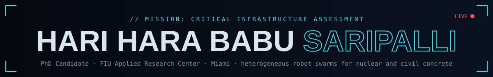
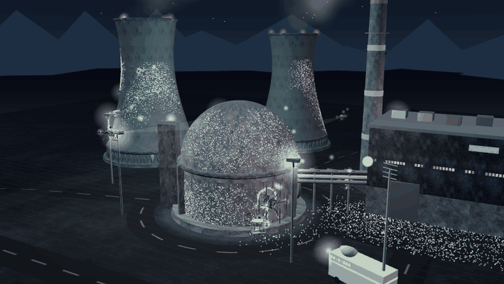
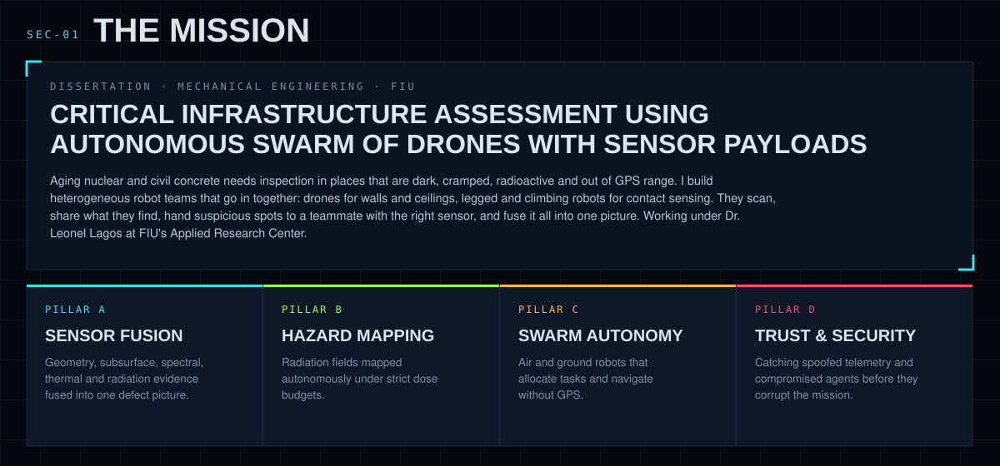
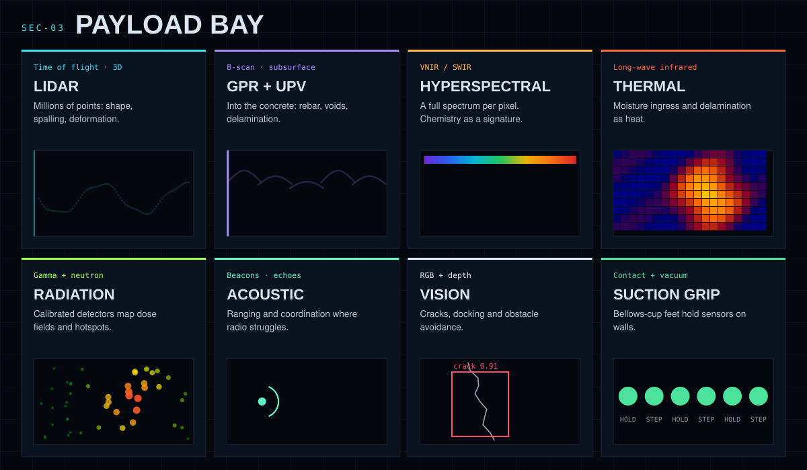
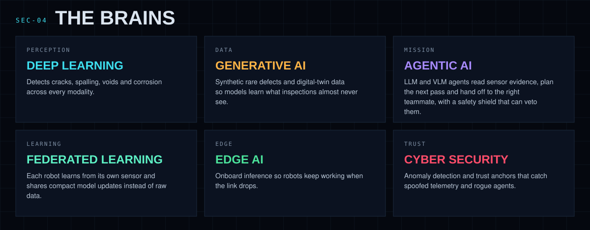
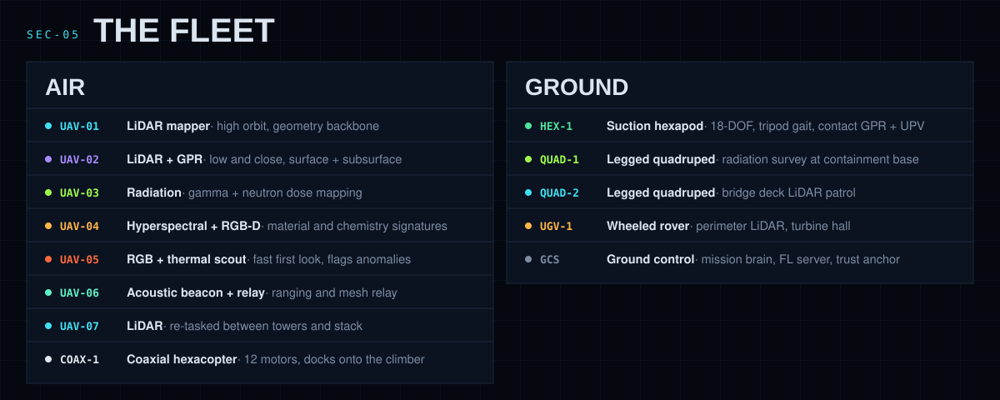

  

  

  ▲ live WebGL render · 8 drones + 4 ground robots · no GPS · cross-modal defect handoff · federated learning · spoof defense

  
   
  

  

  

  

  

  

## `SEC-06` FLIGHT LOG

| | Venue | Work | Status |
|:-:|---|---|:-:|
| 📡 |  | **[Physics-Based Simulation Framework for Multi-Sensor Fusion Benchmarking in UAV Concrete Inspection: A Monte Carlo Reproducibility Study](https://doi.org/10.1109/JSEN.2026.3703331)** · 2026 |  |
| 🛰️ |  | **[LSTM-VAE for Temporal Anomaly Detection in Drone Trajectory Analysis: A Comparative Study for Critical Infrastructure Protection](https://doi.org/10.3390/fi18060301)** · 2026 · 18(6), 301 |  |
| ☢️ |  | **[Drone LiDAR and Ground-Penetrating Radar Simulation for Concrete Inspection in Nuclear Facilities](https://doi.org/10.13182/T134-11489)** · 2026 · Vol. 134, p. 224 |  |
| 🛡️ |  | **PRAHARI**: drones as calibrated aerial trust anchors for radiological IoT sensor networks |  |
| ⚔️ |  | Impact of cyber attacks on autonomous drone inspection of containment structures |  |
| 📖 | Book chapters · conference papers | More in the pipeline, full list on request |  |

## `SEC-07` TOOLKIT

  

## `SEC-08` TELEMETRY

  
  

  <picture>
    <source media="(prefers-color-scheme: dark)" srcset="https://raw.githubusercontent.com/harihara5/HARI-HARA/output/github-snake-dark.svg"/>
    
  </picture>

## `SEC-09` OPEN A CHANNEL

Research collaborations, reviewing, and robot talk are all welcome. Step inside the live version: **[Mission Control ↗](https://harihara5.github.io/HARI-HARA/)**

  signal lost · returning to base · © 2026 Hari Hara Babu Saripalli

