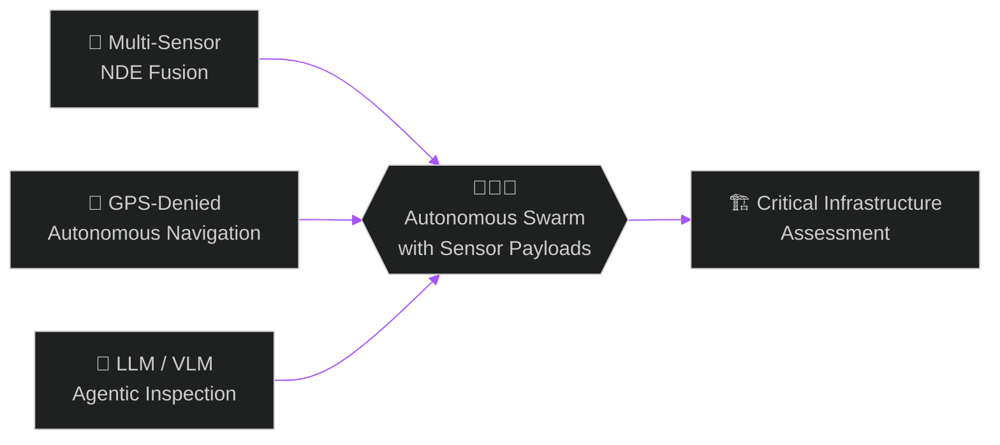

  

  

  ▲ live WebGL render · 8 drones + 4 ground robots · no GPS · cross-modal defect handoff · federated learning · spoof defense

  <!-- LinkedIn / Scholar / ORCID / Email badges go here once links are in -->
  

  

  

## 🛰️ `> boot sequence`

  

## 🧠 `> how my drones think`

  

Different sensors, different views of the same wall. **LiDAR** maps the surface geometry, **Ground Penetrating Radar** looks *inside* the concrete for rebar and voids, and **hyperspectral imaging** reads chemistry the human eye can't see. Fuse them, and you get a defect map no single sensor could produce. Then a **vision-language agent** reads that map and decides where the swarm flies next.

## 🗺️ `> dissertation flight plan`

## 🔬 `> active missions`

<table>
<tr>
<td width="50%" valign="top">

### 📡 Multi-Sensor NDE Fusion
LiDAR + GPR + hyperspectral fusion for finding what's wrong *inside* concrete, not just on it.

`Python` `MATLAB` `Deep Learning`

</td>
<td width="50%" valign="top">

### 🐝 Drone Swarm Autonomy
VLM-driven coordination and federated fusion so a team of drones splits the job and shares what it learns.

`Swarm` `VLM` `Simulation`

</td>
</tr>
<tr>
<td width="50%" valign="top">

### 🦎 Hybrid UAS + UGV Wall Drone
One platform that flies, drives on the ground, and **sticks to walls and ceilings** using thrust adhesion.

`Hardware` `Control` `Prototype`

</td>
<td width="50%" valign="top">

### 🌈 Hyperspectral Mapping
Spectral signatures from 400 to 1000 nm turned into material and damage maps.

`HSI` `Computer Vision` `Remote Sensing`

</td>
</tr>
</table>

> 🔒 Code lives in private repos while papers are under review. Ask and I'm happy to talk shop.

## 📚 `> flight log: publications`

| | Venue | Work | Status |
|:-:|---|---|:-:|
| 🛡️ |  | **PRAHARI**: drones as calibrated aerial trust anchors for radiological IoT sensor networks |  |
| ⚔️ |  | Impact of cyber attacks on autonomous drone inspection of containment structures |  |
| 📡 |  | Physics-based simulation framework for benchmarking LiDAR + GPR fusion |  |
| 🛰️ |  | LSTM-VAE detection of anomalous drone trajectories |  |

<b>📖 Book chapters, conference papers & more in the pipeline</b> (click to expand)

 

- *Add here*

## 🛠️ `> payload manifest`

  

  
  
  
  
  
  

  
  
  
  
  
  
  
  
  
  
  
  

## 📊 `> telemetry`

  
  

  

  

  <picture>
    <source media="(prefers-color-scheme: dark)" srcset="https://raw.githubusercontent.com/harihara5/HARI-HARA/output/github-snake-dark.svg"/>
    
  </picture>

  <code>if (too_dangerous_for_humans) send(drone); if (too_big_for_one) send(swarm);</code>

  

